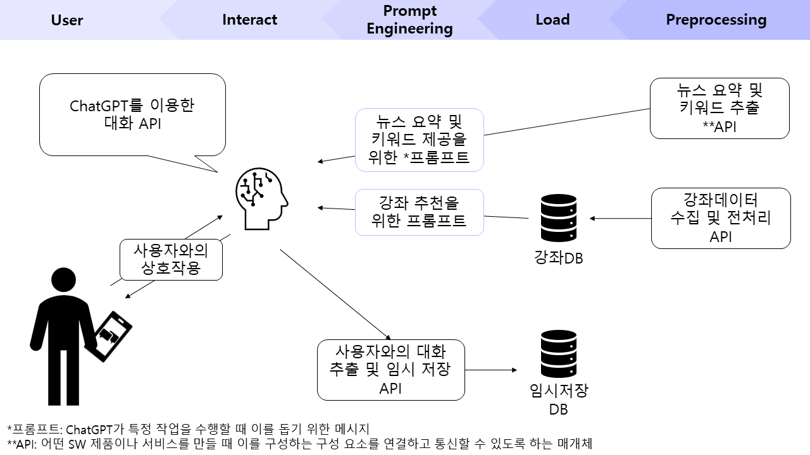

## 5060 트렌드 Job자!
### 제작자
<table>
  <tr>
    <td align=center>
      데이터사이언스학과 21    
      <a href="https://github.com/seyeon78">김세연</a>
    </td>
    <td align=center>
      데이터사이언스학과 21  
      <a href="https://github.com/nuebaek">백다은</a>
    </td>
    <td align=center>
      데이터사이언스학과 21  
      <a href="https://github.com/cloveomr">엄채린</a>
    </td>
  </tr>
  <tr>
    <td align=center>
      데이터사이언스학과 21  
      <a href="https://github.com/HopesofApril">오수민</a>
    </td>
    <td align=center>
       데이터사이언스학과 21  
      <a href="https://github.com/cAhyoung">조아영</a>
    </td>
  </tr>
</table>

### 개발환경
|||웹 개발|카카오챗봇 개발|
|---|---|---|---|
|Environment|OS|Window 11|Ubuntu 18.04.2 (GoormIDE)|
|Language|Python|3.10.9|3.8.0|
||openai|0.28.1|0.28.0|
|Server|Flask|3.0.0|3.0.0|
|DB|MongoDB|7.0.2|4.4.25|
|Front||HTML5+CSS3+JavaScript|Kakao Chatbot Service|

### 아이디어 소개
- 주된 직장의 평균 연령 50.5세, 그러나 평균 수명은 82.7세로 퇴직 후 약 30년을 직장 없이 생활해야 함
- 여러 기사에서 중장년층 및 노년층을 대상으로 한 설문조사를 진행 하였을 때, 대부분 계속해서 일하고 싶다는 답변을 남김
- 해당 내용을 바탕으로 안정적인 노후와 만족스러운 삶을 위해 재취업을 도울 수 있는 서비스인 해당 아이디어를 제시함

##### 제공 서비스
- 사용자의 관심사 등에 대한 트렌드 제공
  - 어떤 한 분야의 전문가로 살아온 중장년층은 새로운 직업 트렌드를 따라가는데 어려움을 느끼기 쉬움
  - 뉴스 데이터를 활용해 관심있는 분야 등의 트렌드 정보 제공
  - 총 3개의 기사를 제목, 세줄요약, 링크로 정리해 정보 제공
- 사용자의 관심 분야 등에 대한 강좌 추천
  - 사용자가 관심있는 분야와 관련한 내일배움카드 강좌 추천
  - 강의를 직접 찾아보는데 소요되는 시간 단축

##### 기대효과
- 재취업을 위한 정보 격차를 줄이고, 효율적인 정보 제공
- 중장년층 사용자의 경제적 안정과 삶의 질 향상에 기여
- 트렌드 제공을 통해 관심 분야 동향 파악에 소요되는 시간 단축
- 교육 프로그램 추천으로 사용자 맞춤 학습 기회 제공
- 경제적 자립 증진 및 경제활동 활성화
- 
##### 웹챗봇 시연 영상
<a href="https://www.youtube.com/watch?v=Vb5ykw8FV-o">시연 영상 바로가기</a>
